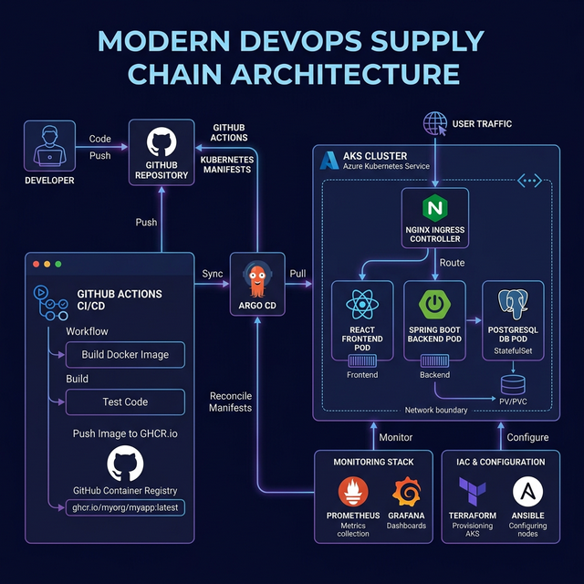

# Supply-Chain (GitOps Enterprise Edition)

## Project Overview

This project implements a complete supply chain management system with a modern three-tier architecture. It features a Spring Boot backend, a React frontend, and a PostgreSQL database.

The entire infrastructure has been modernized and is now managed entirely through **GitOps** principles using an enterprise-grade cloud-native DevOps stack.

## Architecture



## Core Technologies

### Local Development
- **Docker Compose**: For seamless local execution of the full stack.
- **Spring Boot 3 & React (Vite)**: The core application frameworks.
- **PostgreSQL 16**: Relational data persistence.

### Production Infrastructure & DevOps
- **Azure Kubernetes Service (AKS)**: Container orchestration layer.
- **Terraform (IaC)**: Automated provisioning of Azure infrastructure (Resource Groups, VNets, AKS Clusters).
- **Ansible**: Configuration management for installing cluster interaction tools (`kubectl`, `helm`, `argo`).
- **GitHub Actions**: Continuous Integration (CI) pipeline to run tests, build images, push to GHCR, and strictly update Kubernetes manifests.
- **ArgoCD**: Continuous Deployment (CD). Watches Git repositories and syncs K8s manifests directly into the live cluster.
- **Prometheus & Grafana**: Complete cluster and application-level observability stack deployed via Helm.
- **NGINX Ingress Controller**: For advanced request routing and load balancing within Kubernetes.

## Getting Started

### Prerequisites
- Docker & Docker Compose (for local development)
- Azure CLI (`az`), `kubectl`, and `terraform`
- Ansible (optional, to install the above CLI tools automatically)

### Local Development Loop
```bash
# Start the full stack locally
docker compose up -d

# Frontend will be available at http://localhost:80
# Backend API will be available at http://localhost:8080
```

## Infrastructure Setup

### 1. Provision Infrastructure
We use Terraform to physically create the cloud resources.
```bash
cd terraform/
terraform init
terraform plan
terraform apply
```

### 2. Connect to the Cluster
Once Terraform finishes, configure your local `kubectl` to talk to Azure:
```bash
az aks get-credentials --resource-group rg-supplychain-dev --name aks-supplychain-dev
```

## GitOps Workflow (How Deployments Work)

Deployments to production require exactly zero manual commands. Everything is triggered by a `git push` to the `master` branch.

1. **Continuous Integration (CI)**: GitHub Actions builds the `frontend` and `backend` Docker containers.
2. **Artifact Storage**: Images are pushed to GitHub Container Registry (`ghcr.io`).
3. **Manifest Updating**: GitHub Actions automatically rewrites `k8s/frontend/deployment.yaml` and `k8s/backend/deployment.yaml` with the new Docker image hash and commits these files back to the repository.
4. **Continuous Deployment (CD)**: ArgoCD, running inside the AKS cluster, detects the new commit. It immediately pulls the new configuration and gracefully updates the live pods with zero downtime. 

## Kubernetes Directory Structure (`/k8s`)
- **`namespace.yaml`**: The isolated `supplychain` working environment.
- **`ingress.yaml`**: Routes external web traffic: `/api/*` goes to the backend, `/` goes to the frontend SPA.
- **`postgres/`**: StatefulSet configuration ensuring database data survives pod restarts via Persistent Volumes.
- **`backend/ & frontend/`**: Deployment and internal cluster Services for the applications.
- **`argocd-apps/`**: The GitOps glue. `Application` manifests telling ArgoCD what folders to monitor.

## Security & Observability
- All Docker builds use unprivileged, lightweight Alpine bases.
- Secrets are dynamically injected into K8s at runtime or managed via CI.
- The `kube-prometheus-stack` operates out-of-the-box, providing dashboard-driven insights into CPU, Memory, API latency, and database connection metrics.
